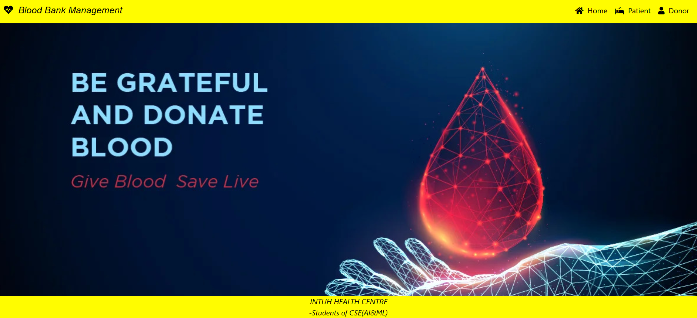
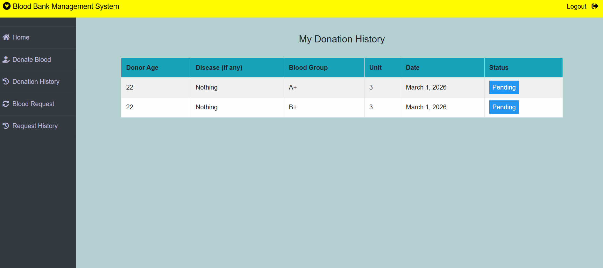
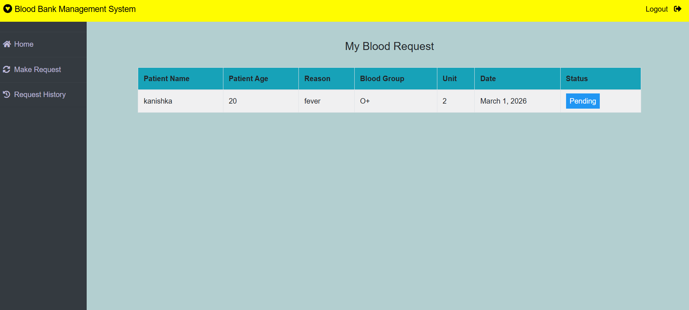
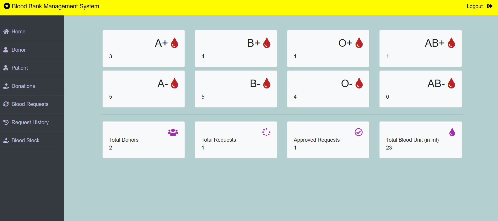

# 🩸 Blood Bank Management System

A role-based Blood Bank Management System built using Django that connects Donors, Patients, and Admin in a centralized platform to efficiently manage blood inventory and emergency requests.

---

## 🚀 Project Overview

In real-world emergency situations, patients often struggle to find the correct blood group at the right time.  
This system solves that problem by providing an online platform where:

- 🧑‍🤝‍🧑 Donors can register and donate blood
- 🏥 Patients can request blood
- 🛠 Admin can approve/reject requests
- 📦 Blood stock updates automatically based on approvals

This project implements a complete inventory + approval workflow system.

---

## 🏗 Tech Stack

- **Backend:** Python, Django
- **Frontend:** HTML, CSS, JavaScript
- **Database:** SQLite
- **Authentication:** Django Authentication System
- **Authorization:** Role-Based Access Control (Django Groups)

---

## 👥 User Roles

### 🔹 Admin
- Manage blood stock
- Approve/Reject blood requests
- Approve/Reject donations
- View dashboard analytics
- Manage donors and patients

### 🔹 Donor
- Register & Login
- Submit blood donation request
- Track donation status

### 🔹 Patient
- Register & Login
- Request blood (units & reason)
- Track request status

---

## 🧠 Core Business Logic

- On first run, predefined blood groups are initialized.
- Before approving a blood request, stock availability is validated.
- If donation is approved → `stock.unit += donation.unit`
- If blood request is approved → `stock.unit -= request.unit`
- Dashboard statistics use Django ORM aggregation queries.

---

## 📊 Screenshots

### 🏠 Home Page


### 🧑 Donor Dashboard


### 🏥 Patient Dashboard


### 🛠 Admin Dashboard



---

## ⚙️ Installation & Setup

1. Clone the repository

```bash
git clone https://github.com/NithinChalla126/Blood-Bank-Management-System.git
cd Blood-Bank-Management-System
```

2. Create virtual environment

```bash
python -m venv venv
```

3. Activate virtual environment:
Windows: 
```bash
venv\Scripts\activate
```

4. Install dependencies:
```bash
pip install -r requirements.txt
```

5. Run migrations: 
```bash
python manage.py migrate
```

6. Create superuser:
```bash
python manage.py createsuperuser
```


7. Run server: 
```bash
python manage.py runserver
```

Open in browser:

```text
http://127.0.0.1:8000/
```
---

## 🔮 Future Improvements

- Add REST API support
- Implement email notifications
- Improve UI/UX design
- Add transaction management for stock updates
- Deploy to cloud platform (AWS / Render / Railway)

---

## 📌 Author

Developed as a full-stack Django project to demonstrate role-based authentication, inventory management, and approval workflow systems.